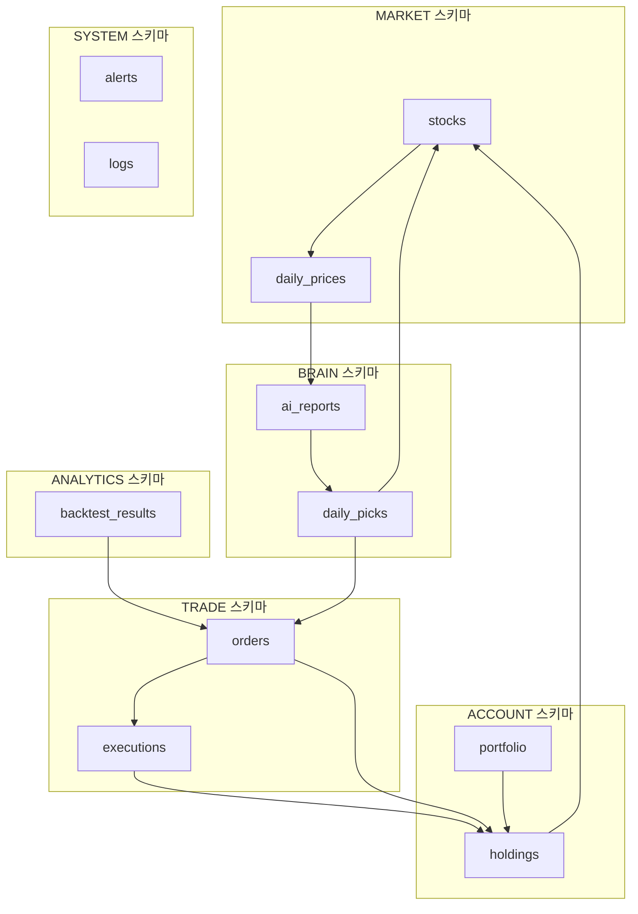

# AEGIS Database v3.1 - 설계 문서

## 개요
AEGIS(Algorithmic Equity & Global Investment System) v3.1 데이터베이스는 금융 투자 분석 및 자동 매매 시스템의 핵심 데이터 인프라입니다. 6개의 논리적 스키마로 구성되며, 고빈도 시장 데이터 처리와 복잡한 AI 분석을 지원합니다.

---

## 1. ERD (Entity Relationship Diagram)

### 전체 관계도


### 테이블 상세 관계
1. **MARKET.stocks** (1) → (N) **MARKET.daily_prices**
2. **ACCOUNT.portfolio** (1) → (N) **ACCOUNT.holdings**
3. **ACCOUNT.holdings** (N) → (1) **MARKET.stocks**
4. **BRAIN.ai_reports** (1) → (N) **BRAIN.daily_picks**
5. **BRAIN.daily_picks** (N) → (1) **MARKET.stocks**
6. **TRADE.orders** (1) → (N) **TRADE.executions**
7. **TRADE.orders** (N) → (1) **ACCOUNT.holdings**
8. **ANALYTICS.backtest_results** (N) → (1) **TRADE.orders**

---

## 2. 스키마 상세 설계

### 2.1 MARKET 스키마
```sql
CREATE SCHEMA MARKET;

-- 종목 마스터
CREATE TABLE MARKET.stocks (
    stock_id BIGSERIAL PRIMARY KEY,
    ticker VARCHAR(20) NOT NULL UNIQUE,
    name VARCHAR(100) NOT NULL,
    market_type VARCHAR(10) CHECK (market_type IN ('KOSPI', 'KOSDAQ', 'NYSE', 'NASDAQ')),
    sector VARCHAR(50),
    industry VARCHAR(50),
    market_cap NUMERIC(20,0), -- 원(KRW), BigInteger
    listing_date DATE,
    is_active BOOLEAN DEFAULT true,
    created_at TIMESTAMP DEFAULT CURRENT_TIMESTAMP,
    updated_at TIMESTAMP DEFAULT CURRENT_TIMESTAMP
);

-- 일별 가격 데이터
CREATE TABLE MARKET.daily_prices (
    price_id BIGSERIAL PRIMARY KEY,
    stock_id BIGINT NOT NULL REFERENCES MARKET.stocks(stock_id),
    trade_date DATE NOT NULL,
    open_price NUMERIC(12,2),
    high_price NUMERIC(12,2),
    low_price NUMERIC(12,2),
    close_price NUMERIC(12,2) NOT NULL,
    volume BIGINT NOT NULL, -- 주(shares) 단위
    amount NUMERIC(20,0), -- 거래대금
    changes NUMERIC(6,2), -- 수익률 % (5.23 = +5.23%)
    created_at TIMESTAMP DEFAULT CURRENT_TIMESTAMP,
    UNIQUE(stock_id, trade_date)
);
```

### 2.2 ACCOUNT 스키마
```sql
CREATE SCHEMA ACCOUNT;

-- 포트폴리오
CREATE TABLE ACCOUNT.portfolio (
    portfolio_id BIGSERIAL PRIMARY KEY,
    name VARCHAR(100) NOT NULL,
    strategy_type VARCHAR(30),
    target_return NUMERIC(6,2), -- 목표수익률 %
    max_drawdown NUMERIC(6,2), -- 최대손실율 %
    initial_capital NUMERIC(15,0) NOT NULL,
    current_value NUMERIC(15,0),
    created_at TIMESTAMP DEFAULT CURRENT_TIMESTAMP,
    is_active BOOLEAN DEFAULT true
);

-- 보유종목
CREATE TABLE ACCOUNT.holdings (
    holding_id BIGSERIAL PRIMARY KEY,
    portfolio_id BIGINT NOT NULL REFERENCES ACCOUNT.portfolio(portfolio_id),
    stock_id BIGINT NOT NULL REFERENCES MARKET.stocks(stock_id),
    quantity BIGINT NOT NULL CHECK (quantity >= 0), -- 주(shares) 단위
    avg_purchase_price NUMERIC(12,2) NOT NULL,
    current_value NUMERIC(15,0),
    unrealized_pnl NUMERIC(12,2), -- 평가손익
    unrealized_pnl_rate NUMERIC(6,2), -- 평가손익률 %
    last_updated TIMESTAMP DEFAULT CURRENT_TIMESTAMP,
    UNIQUE(portfolio_id, stock_id)
);
```

### 2.3 BRAIN 스키마
```sql
CREATE SCHEMA BRAIN;

-- AI 분석 리포트
CREATE TABLE BRAIN.ai_reports (
    report_id BIGSERIAL PRIMARY KEY,
    stock_id BIGINT NOT NULL REFERENCES MARKET.stocks(stock_id),
    analysis_date DATE NOT NULL,
    model_version VARCHAR(20),
    sentiment_score NUMERIC(4,2) CHECK (sentiment_score BETWEEN -10 AND 10),
    confidence_score NUMERIC(4,2) CHECK (confidence_score BETWEEN 0 AND 1),
    target_price NUMERIC(12,2),
    risk_level VARCHAR(10) CHECK (risk_level IN ('LOW', 'MEDIUM', 'HIGH')),
    summary TEXT,
    raw_data JSONB,
    created_at TIMESTAMP DEFAULT CURRENT_TIMESTAMP,
    UNIQUE(stock_id, analysis_date, model_version)
);

-- 일별 추천종목
CREATE TABLE BRAIN.daily_picks (
    pick_id BIGSERIAL PRIMARY KEY,
    report_id BIGINT NOT NULL REFERENCES BRAIN.ai_reports(report_id),
    pick_date DATE NOT NULL,
    action VARCHAR(10) CHECK (action IN ('BUY', 'SELL', 'HOLD')),
    priority_score NUMERIC(4,2),
    expected_return NUMERIC(6,2), -- 예상수익률 %
    holding_period INTEGER, -- 예측보유기간(일)
    is_executed BOOLEAN DEFAULT false,
    created_at TIMESTAMP DEFAULT CURRENT_TIMESTAMP
);
```

### 2.4 TRADE 스키마
```sql
CREATE SCHEMA TRADE;

-- 주문
CREATE TABLE TRADE.orders (
    order_id BIGSERIAL PRIMARY KEY,
    holding_id BIGINT REFERENCES ACCOUNT.holdings(holding_id),
    pick_id BIGINT REFERENCES BRAIN.daily_picks(pick_id),
    order_type VARCHAR(10) CHECK (order_type IN ('MARKET', 'LIMIT', 'STOP')),
    side VARCHAR(4) CHECK (side IN ('BUY', 'SELL')),
    quantity BIGINT NOT NULL, -- 주(shares) 단위
    limit_price NUMERIC(12,2),
    status VARCHAR(20) CHECK (status IN ('PENDING', 'PARTIAL_FILLED', 'FILLED', 'CANCELLED', 'REJECTED')),
    order_time TIMESTAMP DEFAULT CURRENT_TIMESTAMP,
    expires_at TIMESTAMP,
    created_by VARCHAR(50)
);

-- 체결
CREATE TABLE TRADE.executions (
    execution_id BIGSERIAL PRIMARY KEY,
    order_id BIGINT NOT NULL REFERENCES TRADE.orders(order_id),
    executed_quantity BIGINT NOT NULL, -- 주(shares) 단위
    executed_price NUMERIC(12,2) NOT NULL,
    executed_time TIMESTAMP DEFAULT CURRENT_TIMESTAMP,
    commission NUMERIC(10,2),
    net_amount NUMERIC(15,0),
    exchange_ref VARCHAR(100)
);
```

### 2.5 ANALYTICS 스키마
```sql
CREATE SCHEMA ANALYTICS;

-- 백테스트 결과
CREATE TABLE ANALYTICS.backtest_results (
    backtest_id BIGSERIAL PRIMARY KEY,
    strategy_name VARCHAR(100) NOT NULL,
    test_period_start DATE NOT NULL,
    test_period_end DATE NOT NULL,
    initial_capital NUMERIC(15,0) NOT NULL,
    final_value NUMERIC(15,0) NOT NULL,
    total_return NUMERIC(8,2) NOT NULL, -- 총수익률 %
    annual_return NUMERIC(8,2),
    sharpe_ratio NUMERIC(6,2),
    max_drawdown NUMERIC(6,2),
    win_rate NUMERIC(6,2),
    total_trades INTEGER,
    parameters JSONB,
    created_at TIMESTAMP DEFAULT CURRENT_TIMESTAMP
);
```

### 2.6 SYSTEM 스키마
```sql
CREATE SCHEMA SYSTEM;

-- 알림
CREATE TABLE SYSTEM.alerts (
    alert_id BIGSERIAL PRIMARY KEY,
    alert_type VARCHAR(30) CHECK (alert_type IN ('ERROR', 'WARNING', 'INFO', 'TRADE_SIGNAL')),
    severity VARCHAR(10) CHECK (severity IN ('CRITICAL', 'HIGH', 'MEDIUM', 'LOW')),
    module VARCHAR(50),
    message TEXT NOT NULL,
    data JSONB,
    is_acknowledged BOOLEAN DEFAULT false,
    created_at TIMESTAMP DEFAULT CURRENT_TIMESTAMP
);

-- 시스템 로그
CREATE TABLE SYSTEM.logs (
    log_id BIGSERIAL PRIMARY KEY,
    log_level VARCHAR(10) CHECK (log_level IN ('DEBUG', 'INFO', 'WARN', 'ERROR', 'FATAL')),
    logger VARCHAR(100),
    message TEXT NOT NULL,
    stack_trace TEXT,
    request_id VARCHAR(50),
    user_id VARCHAR(50),
    created_at TIMESTAMP DEFAULT CURRENT_TIMESTAMP
);
```

---

## 3. 인덱스 전략

### 3.1 핵심 인덱스 목록

#### MARKET 스키마
```sql
-- stocks 테이블
CREATE INDEX idx_stocks_ticker ON MARKET.stocks(ticker);
CREATE INDEX idx_stocks_sector ON MARKET.stocks(sector);
CREATE INDEX idx_stocks_market_cap ON MARKET.stocks(market_cap DESC);

-- daily_prices 테이블
CREATE INDEX idx_daily_prices_stock_date ON MARKET.daily_prices(stock_id, trade_date DESC);
CREATE INDEX idx_daily_prices_date ON MARKET.daily_prices(trade_date);
CREATE INDEX idx_daily_prices_volume ON MARKET.daily_prices(volume DESC) WHERE trade_date = CURRENT_DATE;
```

#### ACCOUNT 스키마
```sql
-- holdings 테이블
CREATE INDEX idx_holdings_portfolio ON ACCOUNT.holdings(portfolio_id);
CREATE INDEX idx_holdings_stock ON ACCOUNT.holdings(stock_id);
CREATE INDEX idx_holdings_pnl ON ACCOUNT.holdings(unrealized_pnl_rate DESC);
```

#### BRAIN 스키마
```sql
-- ai_reports 테이블
CREATE INDEX idx_ai_reports_date ON BRAIN.ai_reports(analysis_date DESC);
CREATE INDEX idx_ai_reports_sentiment ON BRAIN.ai_reports(sentiment_score DESC);
CREATE INDEX idx_ai_reports_stock_date ON BRAIN.ai_reports(stock_id, analysis_date DESC);

-- daily_picks 테이블
CREATE INDEX idx_daily_picks_date_action ON BRAIN.daily_picks(pick_date, action);
CREATE INDEX idx_daily_picks_priority ON BRAIN.daily_picks(priority_score DESC, pick_date);
```

#### TRADE 스키마
```sql
-- orders 테이블
CREATE INDEX idx_orders_time ON TRADE.orders(order_time DESC);
CREATE INDEX idx_orders_status ON TRADE.orders(status) WHERE status IN ('PENDING', 'PARTIAL_FILLED');
CREATE INDEX idx_orders_holding ON TRADE.orders(holding_id);

-- executions 테이블
CREATE INDEX idx_executions_order ON TRADE.executions(order_id);
CREATE INDEX idx_executions_time ON TRADE.executions(executed_time DESC);
```

### 3.2 파티셔닝 전략
```sql
-- daily_prices 테이블 월별 파티셔닝
CREATE TABLE MARKET.daily_prices_y2024m01 PARTITION OF MARKET.daily_prices
FOR VALUES FROM ('2024-01-01') TO ('2024-02-01');

-- logs 테이블 일별 파티셔닝
CREATE TABLE SYSTEM.logs_y2024_01_01 PARTITION OF SYSTEM.logs
FOR VALUES FROM ('2024-01-01') TO ('2024-01-02');
```

---

## 4. 데이터 무결성

### 4.1 제약조건
```sql
-- 외래키 캐스케이드 정책
ALTER TABLE ACCOUNT.holdings
ADD CONSTRAINT fk_holdings_stock
FOREIGN KEY (stock_id) 
REFERENCES MARKET.stocks(stock_id)
ON DELETE RESTRICT;

-- 체크 제약조건 강화
ALTER TABLE MARKET.daily_prices
ADD CONSTRAINT chk_price_positive
CHECK (close_price > 0 AND volume >= 0);

ALTER TABLE TRADE.orders
ADD CONSTRAINT chk_order_quantity
CHECK (quantity > 0);

-- 유니크 제약조건
ALTER TABLE BRAIN.daily_picks
ADD CONSTRAINT uniq_daily_pick
UNIQUE (report_id, pick_date, action);
```

### 4.2 트리거
```sql
-- 자동 업데이트 타임스탬프
CREATE OR REPLACE FUNCTION update_updated_at_column()
RETURNS TRIGGER AS $$
BEGIN
    NEW.updated_at = CURRENT_TIMESTAMP;
    RETURN NEW;
END;
$$ language 'plpgsql';

CREATE TRIGGER update_stocks_updated_at BEFORE UPDATE ON MARKET.stocks
FOR EACH ROW EXECUTE FUNCTION update_updated_at_column();

-- holdings 평가손익 자동 계산
CREATE OR REPLACE FUNCTION update_holding_value()
RETURNS TRIGGER AS $$
BEGIN
    NEW.current_value = NEW.quantity * (
        SELECT close_price 
        FROM MARKET.daily_prices 
        WHERE stock_id = NEW.stock_id 
        ORDER BY trade_date DESC 
        LIMIT 1
    );
    
    NEW.unrealized_pnl = NEW.current_value - (NEW.quantity * NEW.avg_purchase_price);
    
    IF NEW.quantity * NEW.avg_purchase_price > 0 THEN
        NEW.unrealized_pnl_rate = (NEW.unrealized_pnl / (NEW.quantity * NEW.avg_purchase_price)) * 100;
    END IF;
    
    RETURN NEW;
END;
$$ language 'plpgsql';

CREATE TRIGGER trigger_update_holding_value BEFORE UPDATE ON ACCOUNT.holdings
FOR EACH ROW EXECUTE FUNCTION update_holding_value();
```

---

## 5. 마이그레이션 가이드

### 5.1 v3.0 → v3.1 업그레이드
```sql
-- 1. 새 스키마 생성
CREATE SCHEMA IF NOT EXISTS ANALYTICS;
CREATE SCHEMA IF NOT EXISTS SYSTEM;

-- 2. 기존 테이블 마이그레이션
ALTER TABLE IF EXISTS logs SET SCHEMA SYSTEM;
ALTER TABLE IF EXISTS backtest_results SET SCHEMA ANALYTICS;

-- 3. 새 컬럼 추가
ALTER TABLE MARKET.stocks ADD COLUMN IF NOT EXISTS industry VARCHAR(50);
ALTER TABLE BRAIN.ai_reports ADD COLUMN IF NOT EXISTS raw_data JSONB;

-- 4. 데이터 타입 변환
ALTER TABLE ACCOUNT.holdings 
ALTER COLUMN quantity TYPE BIGINT,
ALTER COLUMN current_value TYPE NUMERIC(15,0);

-- 5. 인덱스 재구성
REINDEX DATABASE aegis_db;
```

### 5.2 롤백 절차
```sql
-- 롤백 스크립트
BEGIN;
-- 1. 새로 추가된 컬럼 삭제
ALTER TABLE MARKET.stocks DROP COLUMN IF EXISTS industry;
ALTER TABLE BRAIN.ai_reports DROP COLUMN IF EXISTS raw_data;

-- 2. 스키마 복원
ALTER TABLE SYSTEM.logs SET SCHEMA public;
ALTER TABLE ANALYTICS.backtest_results SET SCHEMA public;

-- 3. 스키마 삭제
DROP SCHEMA IF EXISTS SYSTEM CASCADE;
DROP SCHEMA IF EXISTS ANALYTICS CASCADE;
COMMIT;
```

---

## 6. 백업/복구 정책

### 6.1 백업 전략
```
📁 백업 구조
├── daily_full/           # 일별 전체 백업 (00:00)
│   ├── 20240101/
│   │   ├── full_backup.sql
│   │   └── metadata.json
├── hourly_incremental/   # 시간별 증분 백업
│   ├── 20240101_1200/
│   │   ├── incremental.sql
│   │   └── wal_files/
└── transaction_logs/     # 트랜잭션 로그 (15분)
    └── 20240101_1215.wal
```

### 6.2 백업 명령어
```bash
# 전체 백업
pg_dump -h localhost -U aegis_user -F c -b -v -f /backup/daily_full/aegis_full_$(date +%Y%m%d).backup aegis_db

# 증분 백업 (WAL 아카이빙)
archive_command = 'cp %p /backup/wal_archive/%f'

# 특정 스키마만 백업
pg_dump -h localhost -U aegis_user -n MARKET -n TRADE -F c -f /backup/partial/market_trade.backup aegis_db
```

### 6.3 복구 절차
```sql
-- 1. 데이터베이스 재생성
DROP DATABASE IF EXISTS aegis_db;
CREATE DATABASE aegis_db;

-- 2. 전체 백업 복원
pg_restore -h localhost -U aegis_user -d aegis_db /backup/daily_full/aegis_full_20240101.backup

-- 3. WAL 복구 (PITR - Point-in-Time Recovery)
cp /backup/wal_archive/* $PGDATA/pg_wal/
echo "restore_command = 'cp /backup/wal_archive/%f %p'" > $PGDATA/recovery.conf
echo "recovery_target_time = '2024-01-01 12:00:00'" >> $PGDATA/recovery.conf

-- 4. 복구 후 검증
SELECT COUNT(*) FROM MARKET.stocks;
SELECT MAX(trade_date) FROM MARKET.daily_prices;
```

### 6.4 백업 주기
| 데이터 유형 | 백업 주기 | 보관 기간 | 저장 위치 |
|------------|-----------|-----------|-----------|
| 전체 데이터 | 일별 | 30일 | 온프레미스 NAS |
| 증분 데이터 | 시간별 | 7일 | SSD 배열 |
| 트랜잭션 로그 | 15분 | 48시간 | 로컬 디스크 |
| 중요 테이블 | 실시간 스트리밍 | 90일 | 클라우드 스토리지 |

---

## 7. 성능 모니터링

### 7.1 핵심 모니터링 지표
```sql
-- 느린 쿼리 감지
SELECT query, calls, total_time, mean_time, rows
FROM pg_stat_statements
ORDER BY mean_time DESC
LIMIT 10;

-- 인덱스 사용률
SELECT schemaname, tablename, indexname, idx_scan
FROM pg_stat_user_indexes
ORDER BY idx_scan DESC;

-- 테이블 블로팅 확인
SELECT schemaname, tablename,
       n_dead_tup, n_live_tup,
       round(n_dead_tup::float / n_live_tup * 100, 2) as dead_ratio
FROM pg_stat_user_tables
WHERE n_live_tup > 0
ORDER BY dead_ratio DESC;
```

### 7.2 유지보수 작업
```sql
-- 일일 분석 (01:00 실행)
ANALYZE VERBOSE;

-- 주간 인덱스 재구성 (일요일 02:00)
REINDEX TABLE MARKET.daily_prices;
VACUUM FULL ANALYZE;

-- 월간 통계 리셋 (매월 1일 03:00)
SELECT pg_stat_reset();
```

---

## 8. 보안 정책

### 8.1 역할 기반 접근 제어
```sql
-- 역할 생성
CREATE ROLE aegis_readonly;
CREATE ROLE aegis_trader;
CREATE ROLE aegis_analyst;
CREATE ROLE aegis_admin;

-- 권한 부여
GRANT CONNECT ON DATABASE aegis_db TO aegis_readonly;
GRANT USAGE ON SCHEMA MARKET, ACCOUNT TO aegis_trader;
GRANT SELECT ON ALL TABLES IN SCHEMA MARKET, ACCOUNT TO aegis_readonly;
GRANT SELECT, INSERT, UPDATE ON TRADE.orders TO aegis_trader;
GRANT ALL PRIVILEGES ON DATABASE aegis_db TO aegis_admin;

-- 행 수준 보안 (RLS)
ALTER TABLE ACCOUNT.portfolio ENABLE ROW LEVEL SECURITY;
CREATE POLICY portfolio_policy ON ACCOUNT.portfolio
FOR ALL TO aegis_trader
USING (created_by = current_user);
```

---

## 결론
AEGIS v3.1 데이터베이스는 고성능, 고가용성, 강력한 무결성을 갖춘 금융 데이터 플랫폼으로 설계되었습니다. 모듈화된 스키마 구조, 최적화된 인덱스 전략, 체계적인 백업/복구 정책을 통해 24/7 운영 환경에서 안정적인 서비스를 제공합니다.

**최종 점검 사항:**
- [ ] 모든 수량 필드는 `BIGINT` (주 단위)
- [ ] 모든 수익률 필드는 `NUMERIC(6,2)` (% 단위)
- [ ] 모든 시가총액 필드는 `NUMERIC(20,0)` (원 단위)
- [ ] 외래키 관계 검증 완료
- [ ] 인덱스 생성 완료
- [ ] 백업 스크립트 테스트 완료

**문서 버전:** v3.1  
**최종 업데이트:** 2024년 1월 1일  
**적용 데이터베이스:** PostgreSQL 14+
```
