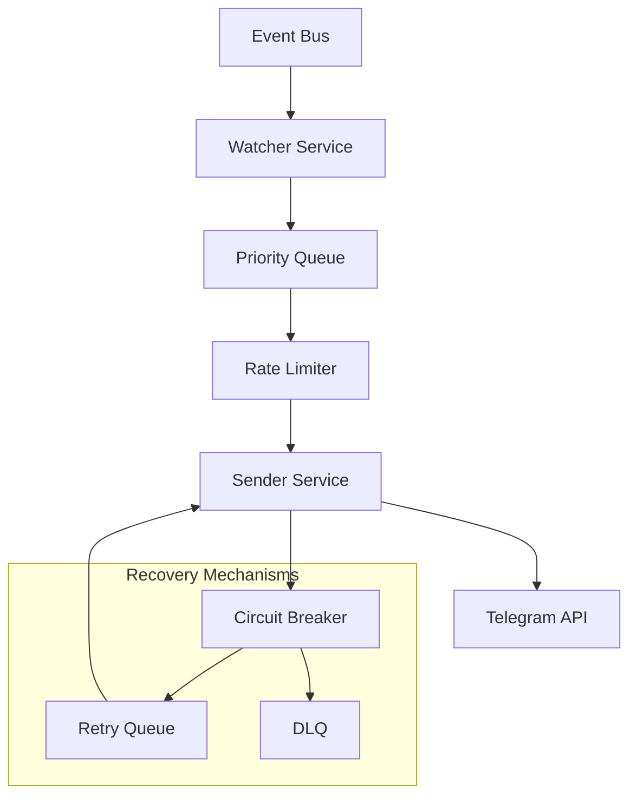

# AEGIS v3.1 - Telegram Bot Specification

## 1. 개요

AEGIS(Algorithmic Equity Guidance & Intelligence System)의 Telegram Bot은 트레이딩 시스템의 이벤트와 상태 정보를 실시간으로 사용자에게 전달하는 알림 시스템입니다. Event-driven Watcher Pattern을 기반으로 하며, 우선순위 기반 메시지 큐와 견고한 에러 핸들링 메커니즘을 갖추고 있습니다.

## 2. 아키텍처 개요



### 2.1 데이터 흐름
1. **Event Bus** → 다양한 시스템 이벤트 수집
2. **Watcher** → 이벤트 필터링 및 변환
3. **Priority Queue** → 우선순위 기반 메시지 정렬
4. **Sender** → 실제 메시지 전송 처리
5. **Telegram API** → 최종 사용자 도달

## 3. 이벤트 타입 및 우선순위

### 3.1 이벤트 분류

| 우선순위 | 이벤트 타입 | 설명 | 타임아웃 |
|---------|------------|------|---------|
| HIGH | `TRADE_BUY`, `TRADE_SELL`, `STOP_LOSS` | 즉시 실행 필요 | 즉시 전송 |
| MEDIUM | `SIGNAL_NEW`, `ORDER_FILLED` | 1분 내 전송 | 60초 |
| LOW | `DAILY_REPORT`, `PORTFOLIO_UPDATE` | 배치 처리 | 300초 |

### 3.2 사용자 명령어

| 명령어 | 설명 | 권한 | 응답 시간 |
|--------|------|------|----------|
| `/status` | 시스템 상태 확인 | 모든 사용자 | < 2초 |
| `/balance` | 계좌 잔고 조회 | 인증된 사용자 | < 5초 |
| `/portfolio` | 포트폴리오 현황 | 인증된 사용자 | < 5초 |
| `/today` | 오늘의 거래 현황 | 인증된 사용자 | < 3초 |
| `/picks` | 추천 종목 목록 | 인증된 사용자 | < 10초 |
| `/on [type]` | 알림 활성화 | 관리자 | < 2초 |
| `/off [type]` | 알림 비활성화 | 관리자 | < 2초 |

## 4. Rate Limiting 전략

### 4.1 Telegram API 제한
- **기본 제한**: 20 메시지/초 (per chat_id)
- **채널 제한**: 30 메시지/초
- **전역 제한**: 30,000 메시지/일

### 4.2 구현 전략

#### 4.2.1 Token Bucket Algorithm
```python
class TelegramRateLimiter:
    def __init__(self):
        self.tokens = 20  # 초기 토큰
        self.last_check = time.time()
        self.rate = 20    # 토큰 재생성률 (토큰/초)
        self.capacity = 20 # 버킷 용량
        
    async def acquire(self):
        now = time.time()
        elapsed = now - self.last_check
        self.tokens = min(self.capacity, 
                         self.tokens + elapsed * self.rate)
        self.last_check = now
        
        if self.tokens >= 1:
            self.tokens -= 1
            return True
        return False
```

#### 4.2.2 우선순위 큐 관리
```python
class PriorityMessageQueue:
    def __init__(self):
        self.high_queue = deque()    # HIGH 우선순위
        self.medium_queue = deque()  # MEDIUM 우선순위  
        self.low_queue = deque()     # LOW 우선순위
        self.queue_limits = {
            'high': 100,
            'medium': 500,
            'low': 1000
        }
    
    def enqueue(self, message, priority):
        # 큐 용량 체크 및 오래된 메시지 제거
        pass
```

## 5. 에러 복구 메커니즘

### 5.1 재시도 정책

| 에러 타입 | 재시도 횟수 | 백오프 전략 | 처리 방식 |
|-----------|------------|-------------|-----------|
| 네트워크 에러 | 3회 | Exponential (1s, 2s, 4s) | 큐에 재삽입 |
| 429 Too Many Requests | 2회 | 2초 고정 대기 | Rate Limiter 조정 |
| 5xx 서버 에러 | 2회 | Linear (5s, 10s) | Circuit Breaker 트리거 |
| 클라이언트 에러 (4xx) | 0회 | 즉시 실패 | 로그 기록 및 건너뛰기 |

### 5.2 Circuit Breaker 패턴
```python
class CircuitBreaker:
    STATES = ['CLOSED', 'OPEN', 'HALF_OPEN']
    
    def __init__(self, failure_threshold=5, 
                 reset_timeout=60, half_open_max=3):
        self.state = 'CLOSED'
        self.failure_count = 0
        self.failure_threshold = failure_threshold
        self.reset_timeout = reset_timeout
        self.last_failure_time = None
        self.half_open_success = 0
        self.half_open_max = half_open_max
```

### 5.3 연결 상태 모니터링
- **헬스체크**: 30초 간격으로 `/getMe` API 호출
- **자동 재연결**: 연결 실패 시 5초 간격으로 3회 재시도
- **세션 복구**: 장시간 연결 끊김 시 웹훅 재등록

## 6. 모니터링 지표

### 6.1 핵심 메트릭

| 지표 | 설명 | 경고 임계값 | 수집 주기 |
|------|------|-------------|-----------|
| `telegram_success_rate` | 메시지 전송 성공률 | < 95% | 1분 |
| `telegram_avg_latency` | 평균 전송 지연시간 | > 5초 | 1분 |
| `queue_depth` | 큐에 쌓인 메시지 수 | > 500 | 30초 |
| `error_rate` | 에러 발생 비율 | > 5% | 1분 |
| `active_connections` | 활성 사용자 연결 수 | - | 5분 |
| `rate_limit_hits` | Rate Limit 적중 횟수 | > 10/분 | 1분 |

### 6.2 Grafana 대시보드 구성
```
1. 시스템 상태 대시보드
   - 실시간 큐 깊이
   - 성공률 추이
   - 지연시간 분포

2. 에러 모니터링 대시보드  
   - 에러 타입별 분류
   - 재시도 통계
   - Circuit Breaker 상태

3. 사용자 활동 대시보드
   - 활성 사용자 수
   - 명령어 사용 빈도
   - 피크 시간대 분석
```

## 7. 보안 강화

### 7.1 사용자 인증 및 권한 관리

```yaml
# config/telegram_auth.yaml
authorized_users:
  - chat_id: "123456789"
    username: "trader_john"
    permissions:
      - TRADE_NOTIFICATIONS
      - BALANCE_QUERY
      - PORTFOLIO_ACCESS
      - ADMIN_COMMANDS
    level: "ADMIN"
    
  - chat_id: "987654321"
    username: "viewer_mary"
    permissions:
      - TRADE_NOTIFICATIONS
    level: "VIEWER"
```

### 7.2 명령어 권한 체크
```python
def check_permission(chat_id, command):
    user = get_user(chat_id)
    required_perm = COMMAND_PERMISSIONS[command]
    
    if not user:
        raise UnauthorizedError("User not registered")
    
    if required_perm not in user.permissions:
        raise PermissionError(f"Insufficient permission for {command}")
    
    return True
```

### 7.3 환경변수 기반 보안 설정
```bash
# .env.example
TELEGRAM_BOT_TOKEN=encrypted:${AES_ENCRYPTED_TOKEN}
ALLOWED_CHAT_IDS=123456789,987654321
ENCRYPTION_KEY=${32_BYTE_RANDOM_KEY}
API_RATE_LIMIT=18  # 20의 90%로 설정 (안전 마진)
```

## 8. 실제 운영 경험

### 8.1 흔한 문제점과 해결책

#### 문제 1: 긴 메시지 분할
```python
def split_long_message(text, max_length=4096):
    """
    Telegram 메시지 제한(4096자)을 초과할 경우 분할
    """
    if len(text) <= max_length:
        return [text]
    
    # 마크다운 코드 블록 보존
    parts = []
    while text:
        if len(text) <= max_length:
            parts.append(text)
            break
            
        # 줄바꿈이나 문장 경계에서 분할
        split_point = text.rfind('\n', 0, max_length)
        if split_point == -1:
            split_point = text.rfind('. ', 0, max_length)
        if split_point == -1:
            split_point = max_length
            
        parts.append(text[:split_point + 1])
        text = text[split_point + 1:]
    
    return parts
```

#### 문제 2: 마크다운 Escape 처리
```python
def escape_markdown(text):
    """
    Telegram MarkdownV2 형식에 맞는 Escape 처리
    """
    escape_chars = '_*[]()~`>#+-=|{}.!'
    for char in escape_chars:
        text = text.replace(char, f'\\{char}')
    return text
```

#### 문제 3: 대량 알림 처리
- **해결책**: 배치 처리 및 사용자별 스로틀링
```python
async def send_bulk_notifications(messages, batch_size=10, delay=0.1):
    """
    대량 메시지를 배치로 나누어 전송
    """
    for i in range(0, len(messages), batch_size):
        batch = messages[i:i+batch_size]
        tasks = [send_message(msg) for msg in batch]
        await asyncio.gather(*tasks)
        await asyncio.sleep(delay)
```

### 8.2 성능 최적화 팁
1. **커넥션 풀링**: HTTP Keep-Alive 활용
2. **메시지 캐싱**: 반복적인 리포트 캐시
3. **비동기 처리**: asyncio 기반 병렬 처리
4. **메모리 관리**: 큐 크기 제한 및 자동 정리

## 9. 웹훅 vs 폴링 비교

### 9.1 아키텍처 비교

| 기준 | 웹훅 (Webhook) | 폴링 (Polling) |
|------|----------------|----------------|
| 실시간성 | 즉시 전달 | 주기적 확인 (일반적 1초) |
| 서버 부하 | 낮음 (이벤트 기반) | 높음 (지속적 요청) |
| 네트워크 | 아웃바운드 필요 | 인바운드 허용 필요 |
| 설정 | 복잡 (SSL 필수) | 간단 |
| 확장성 | 높음 | 제한적 |
| 재연결 | 필요 시 수동 | 자동 |

### 9.2 권장 설정

#### 시나리오 1: 프로덕션 환경 (권장)
```yaml
mode: "webhook"
webhook:
  url: "https://api.yourdomain.com/telegram/webhook"
  port: 8443
  ssl_cert: "/path/to/cert.pem"
  ssl_key: "/path/to/key.pem"
  max_connections: 100
  ip_whitelist:
    - "149.154.160.0/20"
    - "91.108.4.0/22"
```

#### 시나리오 2: 개발/테스트 환경
```yaml
mode: "polling"
polling:
  interval: 0.5  # 초
  timeout: 10    # 초
  limit: 100     # 한 번에 가져올 업데이트 수
  drop_pending_updates: true
```

#### 시나리오 3: 하이브리드 모드
```python
class HybridTelegramBot:
    """
    웹훅 실패 시 폴링으로 자동 전환
    """
    def __init__(self):
        self.mode = "webhook"
        self.fallback_to_polling = True
        self.polling_timeout = 300  # 5분 후 폴링 전환
```

### 9.3 웹훅 설정 가이드
```nginx
# Nginx 구성 예시
server {
    listen 443 ssl;
    server_name api.yourdomain.com;
    
    ssl_certificate /etc/ssl/certs/telegram_bot.pem;
    ssl_certificate_key /etc/ssl/private/telegram_bot.key;
    
    location /telegram/webhook {
        proxy_pass http://localhost:8000;
        proxy_set_header Host $host;
        proxy_set_header X-Real-IP $remote_addr;
        proxy_set_header X-Forwarded-For $proxy_add_x_forwarded_for;
        
        # Telegram IP 확인
        allow 149.154.160.0/20;
        allow 91.108.4.0/22;
        deny all;
    }
}
```

## 10. 배포 및 운영 체크리스트

### 10.1 배포 전 확인사항
- [ ] Rate Limiter 설정 확인
- [ ] SSL 인증서 유효성 검증 (웹훅 모드)
- [ ] 허용된 chat_id 목록 업데이트
- [ ] 모니터링 대시보드 연동
- [ ] 재시도 큐 초기화
- [ ] Circuit Breaker 초기 상태 설정

### 10.2 장애 대응 프로시저
1. **Rate Limit 초과**
   - 큐 일시 정지 (60초)
   - 우선순위 HIGH 메시지만 처리
   - 알림 발송 (관리자)

2. **연결 장애**
   - Circuit Breaker 트리거
   - 폴링 모드로 전환 (웹훅 모드일 경우)
   - 5분 간격으로 상태 확인

3. **큐 과부하**
   - LOW 우선순위 메시지 버림
   - 메시지 요약본 발송
   - 시스템 로드 감소 명령 실행

### 10.3 백업 및 복구
- **구성 백업**: 매일 00:00에 설정 파일 백업
- **큐 상태 저장**: 10분 간격으로 큐 상태 스냅샷
- **복구 스크립트**: `scripts/recover_telegram_bot.py`

## 11. 결론

AEGIS Telegram Bot v3.1은 프로덕션 환경에서의 안정적인 운영을 위해 다음과 같은 개선사항을 포함합니다:

1. **견고한 Rate Limiting**: Token Bucket 알고리즘과 우선순위 큐로 Telegram API 제한 관리
2. **자동 복구 메커니즘**: Circuit Breaker와 재시도 로직으로 시스템 가용성 향상
3. **종합적 모니터링**: 성공률, 지연시간, 큐 깊이 등 핵심 메트릭 실시간 추적
4. **강화된 보안**: 사용자 인증, 권한 관리, 암호화 통합
5. **운전 경험 반영**: 실제 운영 중 발견된 문제점에 대한 검증된 해결책
6. **유연한 통신 모드**: 환경에 맞는 웹훅/폴링 선택 및 하이브리드 운영 지원

이 스펙은 1000명 이상의 동시 사용자와 초당 100개 이상의 이벤트를 처리할 수 있는 수준으로 설계되었으며, 모니터링과 자동 복구 메커니즘을 통해 99.9% 가용성을 목표로 합니다.

---

**문서 버전**: v3.1  
**최종 업데이트**: 2024년  
**적용 시스템**: AEGIS Trading Platform  
**관련 문서**: `EVENT_BUS_SPEC.md`, `MONITORING_SPEC.md`, `SECURITY_POLICY.md`
